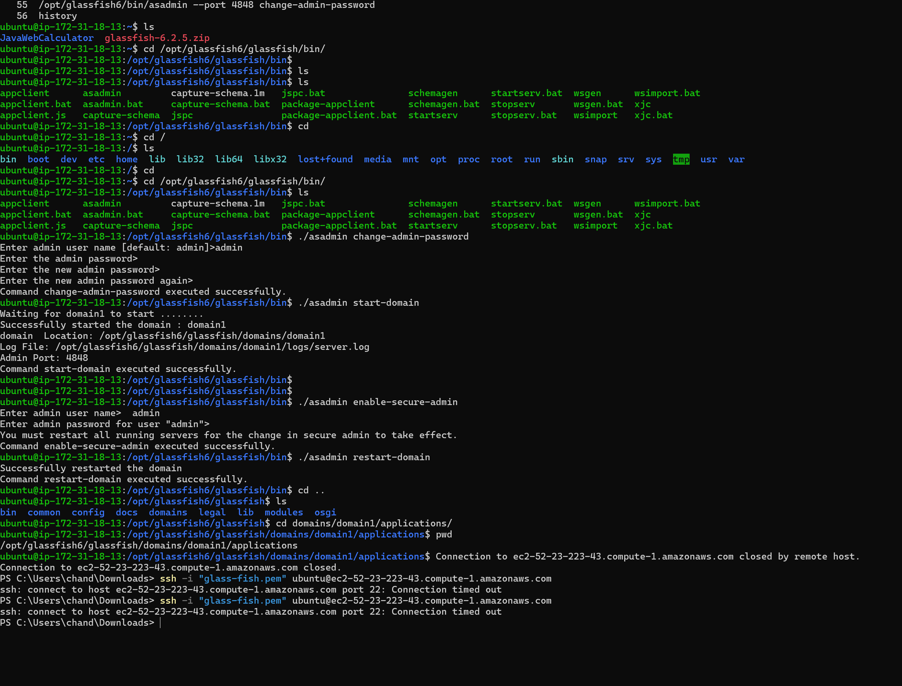
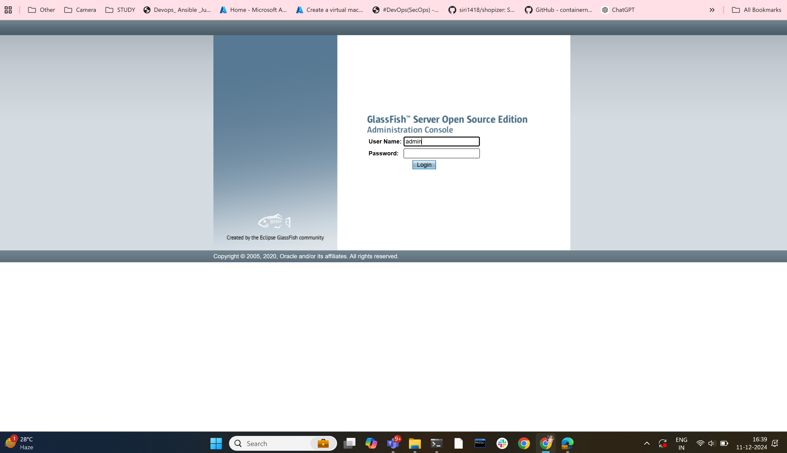
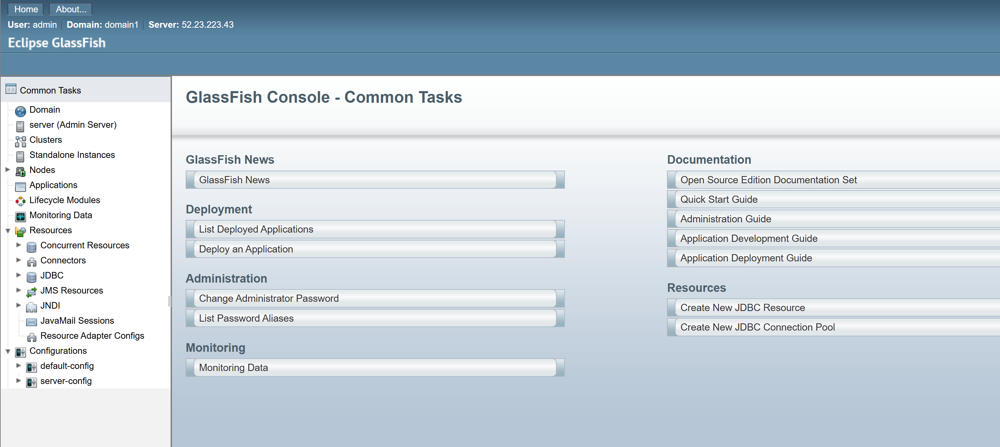

# JavaWebCalculator with GlassFish Web Server
## Prerequisites
Before starting, ensure you have the following:

* An AWS account 
* AWS EC2 instance running with Ubuntu 22.04 or higher.
* Java11 should be installed on your EC2 instance.
* Maven installed on the EC2 instance.
* GlassFish Web Server installed on the EC2 instance.
## Step 1: Set up AWS EC2 Instance
1.Launch EC2 Instance:
* Log in to your AWS Management Console.
* Navigate to EC2 service and launch a new Ubuntu EC2 instance.
* Select an instance type (e.g., t2.micro for testing).
* Configure the security group to allow inbound traffi


2.Connect to Your EC2 Instance:
* Open your terminal or SSH client and connect to your EC2 instance:


## Step 2: Install Java on EC2 Instance
1.Install OpenJDK 11 : Run the following commands to install Java:


```
sudo apt update
sudo apt install openjdk-11-jdk -y
```
2.Verify Installation: To confirm that Java is installed correctly, check the version:

```
java -version
```
## Step 3: Install Maven on EC2 Instance
1.Install Maven: Run the following commands to install Maven:

```
sudo apt update
sudo apt install maven -y
```
2.Verify Installation: To confirm that Maven is installed correctly, check the version:

```
mvn -version
```
## Step 4: Install GlassFish on EC2 Instance

1.Download GlassFish: Download the latest version of GlassFish (e.g., version 6.2.5) from the official website or GitHub repository:
```
wget https://download.eclipse.org/ee4j/glassfish/glassfish-6.2.5.zip

```
2.Install Unzip Utility: If you don’t have the unzip utility, install it with:

```
sudo apt install unzip -y
```
3.Unzip GlassFish: After downloading, unzip the file:

```
 sudo unzip /opt/glassfish.zip -d /opt
 ```
 4.Navigate to GlassFish Directory: Change to the GlassFish directory:

```
cd /opt/glassfish6/glassfish/bin/
```


4.Start GlassFish: Start the GlassFish domain:

```
 ./asadmin restart-domain
 ```

 ### To verify the server is running, open your browser and navigate to:
 ```
 http://<EC2-PUBLIC-IP>:4848
 ```
# How to access the GlassFish web UI
### Everything is ready. Open a web browser and point it to http://SERVER:4848, where SERVER is either the IP address or domain of the hosting server. You’ll be prompted for the admin credentials you set earlier (Figure A).

Figure A

 Figure A
 

 ### Upon successful authentication, you’ll see the GlassFish main page (Figure B), where you can dive in and begin the process of deploying your first Java application.


 ## Figure B
 


 ## Step 6: Stop GlassFish (Optional)

 ```
 /opt/glassfish6/bin/asadmin stop-domain
```


